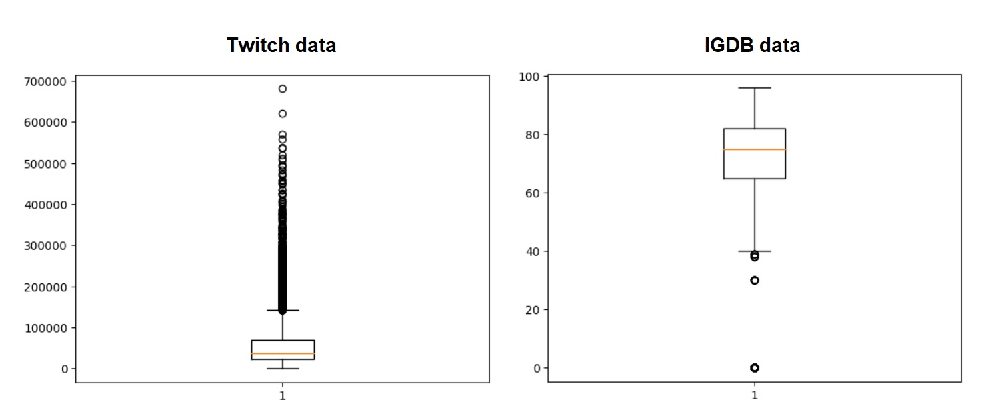
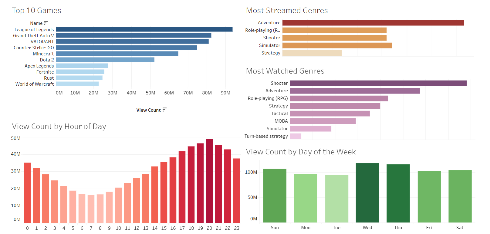

# **About**

Twitch is a popular streaming platform that is being extremely popular in the gaming industry. This analysis was conducted to get insight into the most popular genres (both by streamers and watchers), as well as the periods when the number of watchers is at its peak.

The data required was obtained from Twitch and IGDB, which is a website that contains a lot of video game information. The data was collected using the APIs of said sites. 

Regarding Twitch data, the data was collected for each hour of the day in UTC timezone. The data used in this analysis was collected from April 5th to May 4th 2023.

# **Exploratory Data Analysis**

After collecting the data, exploratory data analysis (EDA) was conducted. The whole process of the EDA can be found [here](./code/EDA.ipynb). 

There are no missing values in the Twitch dataset, while there are missing values in the IGDB dataset. However, all records were kept in the dataset since they were necessary for Tableau, even though they were incomplete.

Neither dataset had normally distributed data. Regarding the Twitch dataset, it a lot of outliers are observed in the number of views, which indicated that some games have much more watchers in comparison to the mean or median numbers. 

|mean|median|max|
|----|------|---|
|58,393|36,559|681,107|

It was also observed that one game had 0 watchers on April 13th at 18:00, while that number rose to 39,476 at 19:00.

|name|date and time|number of watchers|
|----|-------------|------------------|
|Scarface: The World Is Yours|2023-04-13 18:01:59|0|
|Scarface: The World Is Yours|2023-04-13 19:02:01|39,476|

Video games' ratings distribution is also not normal. The distribution is skewed to the left, with the median rating at 75. That means that most streamed games have good ratings, which is to be expected.

# **Data Visualization with Tableau**

The data was visualized using Tableau. The interactive version of the dashboard can be found [on Tableau's website](https://public.tableau.com/views/VideoGameAnalysis_16833879127940/Dashboard1?:language=en-US&:display_count=n&:origin=viz_share_link) or in the [resources](./resources/tableau.html).

It can be observed that three most streamed, and most watched genres, are Action, Shooter, and Role-playing game.

Regarding days of the week, most streams happen on Wednesday and Thursday. Regarding time, most views are between 18:00 and 22:00 hours in UTC timezone. 

This information can be used to decide which games are to be streamed and at what time on which days.

# **License**

All files in this project are licensed under the [GNU General Public License v3.0](./LICENSE).